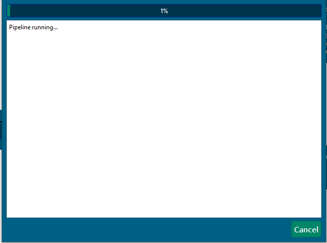
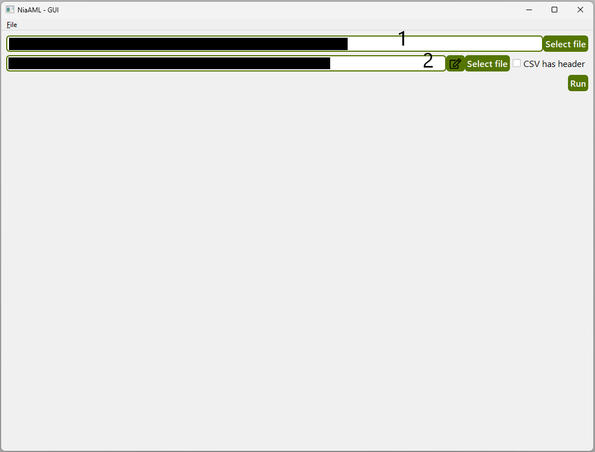

# NiaAML-GUI

---

[](https://pypi.python.org/pypi/niaaml-gui)


[](https://github.com/flukapecnik/NiaAML-GUI/blob/master/LICENSE)

[](http://isitmaintained.com/project/lukapecnik/NiaAML-GUI "Average time to resolve an issue")
[](http://isitmaintained.com/project/lukapecnik/NiaAML-GUI "Percentage of issues still open")

[](https://src.fedoraproject.org/rpms/NiaAML-GUI)

---

This is a basic graphical user interface intended for users of the [NiaAML](https://github.com/lukapecnik/NiaAML) Python package.

* **Python versions:** 3.9.x, 3.10.x, 3.11.x

## Installation

Install NiaAML-GUI with pip:

```sh
pip install niaaml_gui
```

After a successful installation, run the [main.py](niaaml_gui/main.py):

```sh
python main.py
```

### Fedora Linux

To install NiaAML GUI on Fedora, use:

```sh
$ dnf install NiaAML-GUI
```

### Alpine Linux

To install NiaAML GUI on Alpine Linux, please enable Community repository and use:

```sh
$ apk add niaaml-gui
```

## Usage

NiaAML GUI application allows you to use main features of the [NiaAML](https://github.com/lukapecnik/NiaAML) framework. There are two views in the application. In the first one, you can prepare an environment for a pipeline optimization process. The purpose of the second one is to allow you to use an existing pipeline from a file. **The application currently supports data input in a form of CSV files.**

### Optimization View

Below is a screenshot of the first view with labeled components and you can find a description for each component under the screenshot.

<p align="center"></p>

#### 1:

Tabbed view for choosing components for the optimization. Clicked components get transferred to their corresponding brackets (labels **5**, **6** and **7**).

#### 2:

Input CSV dataset's file selection widget. After the dataset has been selected, you can also view and edit it using the edit button next to the `Select file` button. **Also make sure you check the `CSV has header` checkbox in case the selected CSV file has a header row.** Below you can se a screenshot of the CSV file's editting window.

<p align="center"></p>

#### 3:

Dropdown widget for categorical features' encoder selection. It will be ignored in case the dataset contains no categorical features.

#### 4:

Dropdown widget for missing data imputer selection. It will be ignored in case the dataset contains no missing values.

#### 5:

List of selected feature selection algorithms (optional).

#### 6:

List of selected feature transform algorithms (optional).

#### 7:

List of selected classifiers.

#### 8:

Dropdown widget for the selection of components' selection optimization algorithm.

#### 9:

Dropdown widget for the selection of hyperparameters' tuning optimization algorithm. Defaults to **8** if none is selected.

#### 10:

Population size for the components' selection process.

#### 11:

Population size for the hyperparameters' tuning process.

#### 12:

Number of evaluations during the components' selection process.

#### 13:

Number of evaluations during the hyperparameters' tuning process.

#### 14:

Dropdown widget for the selection of a fitness function to use during the pipeline evaluation step.

#### 15:

Destination of the optimization's result (pipeline and text file).

#### Optimization:

Below you can see screenshots of views during and after the optimization has finished.

<p align="center"></p>
<p align="center"></p>

### Usage View

Below is a screenshot of the second view with labeled components and you can find a description for each component under the screenshot.

<p align="center"></p>

#### 1:

Pipeline file selection widget.

#### 2:

Input CSV file selection widget. The file should contain the same headers (if any) than the dataset in the optimization process and there should be no classes (expected results) present. After the dataset has been selected, you can also view and edit it using the edit button next to the `Select file` button. **Also make sure you check the `CSV has header` checkbox in case the selected CSV file has a header row.**

#### Run

You get a similar output than in the optimization process, but this time there is an array of predicted values present.

## Example

Lets say we want to find an optimal classification pipeline for the [Ecoli dataset](https://archive.ics.uci.edu/ml/datasets/ecoli) [[1]](#1). You can see the optimization setup in the screenshot below.

<p align="center"></p>

We hit the `Start optimization` button and wait... You can see the output in the screenshot below.

<p align="center"></p>

There are also 2 new files in the selected destination directory.

<p align="center"></p>

Now we can use the exported pipeline file for further classification on the unseen data.

<p align="center"></p>

The result for 5 individuals is the screenshot below.

<p align="center"></p>

## References

<a id="1">[1]</a> Dua, D. and Graff, C. (2019). [UCI Machine Learning Repository](http://archive.ics.uci.edu/ml). Irvine, CA: University of California, School of Information and Computer Science.

## Cite us

L. Pečnik, I. Fister Jr. "NiaAML: AutoML framework based on stochastic population-based nature-inspired algorithms." Journal of Open Source Software 6.61 (2021): 2949.
