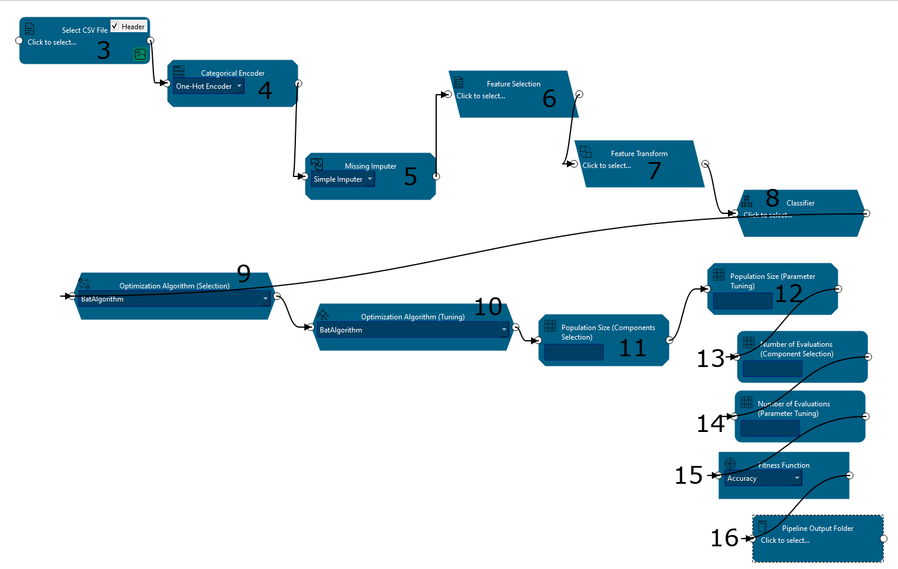
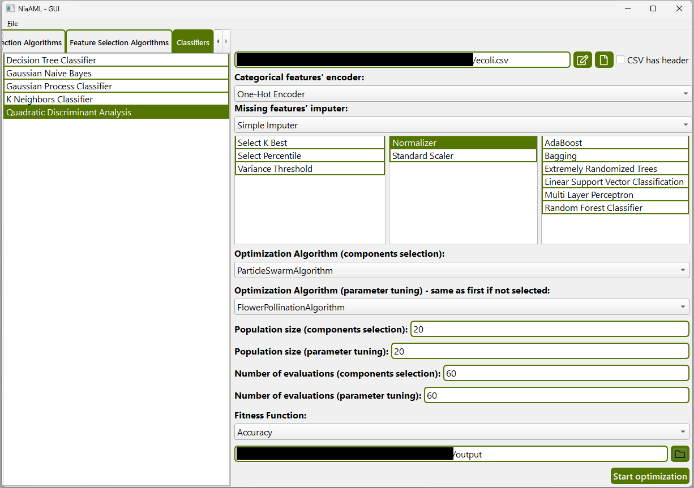
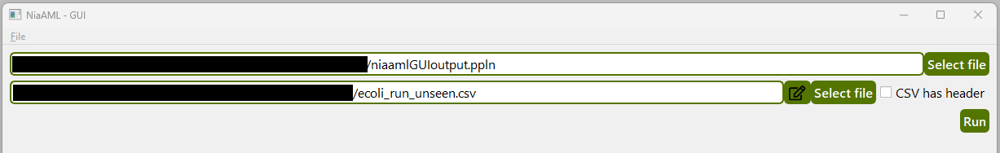

<h1 align="center">
    NiaAML-GUI
</h1>

<p align="center">
    <a href="https://pypi.python.org/pypi/niaaml-gui">
        
    </a>
    
    
        <a href="https://repology.org/project/niaaml-gui/versions">
        
    </a>
    <a href="https://src.fedoraproject.org/rpms/NiaAML-GUI">
        
    </a>
    <a href="https://github.com/flukapecnik/NiaAML-GUI/blob/master/LICENSE">
        
    </a>
    <a href="https://github.com/firefly-cpp/NiaAML-GUI/actions/workflows/test.yml">
        
    </a>
</p>

<p align="center">
    
    <a href='http://isitmaintained.com/project/lukapecnik/NiaAML-GUI "Average time to resolve an issue"'>
        
    </a>
    <a href='http://isitmaintained.com/project/lukapecnik/NiaAML-GUI "Percentage of issues still open"'>
        
    </a>
    
</p>

<p align="center">
    <a href="#-installation">📦 Installation</a> •
    <a href="#-usage">🚀 Usage</a> •
    <a href="#-example">📓 Example</a> •
    <a href="#-references">📝 References</a> •
    <a href="#-cite-us">📄 Cite us</a>
</p>

A graphical user interface for building and running machine learning pipelines using the [NiaAML](https://github.com/firefly-cpp/NiaAML) framework. This GUI now supports **block-based pipeline composition**, drag-and-drop components, visual connections, and CSV editing.

* **Free software:** MIT license
* **Python versions:** 3.10.x, 3.11.x, 3.12.x, 3.13.x

## 📦 Installation

To install `NiaAML-GUI` with pip, use:

```sh
pip install niaaml_gui
```

After successful installation, run [main.py](niaaml_gui/main.py):

```sh
python main.py
```

### Fedora Linux

To install `NiaAML-GUI` on Fedora, use:

```sh
$ dnf install NiaAML-GUI
```

### Alpine Linux

To install `NiaAML-GUI` on Alpine Linux, enable Community repository and use:

```sh
$ apk add niaaml-gui 
```

## 🚀 Usage

NiaAML GUI application allows you to use the main features of the [NiaAML](https://github.com/firefly-cpp/NiaAML) framework. There are two views in the application. In the first one, you can prepare an environment for a pipeline optimization process. The purpose of the second one is to allow you to use an existing pipeline from a file. **The application currently supports data input in the form of CSV files.**

### Pipeline Canvas View

Below is a screenshot of the first view with labeled components and you can find a description for each component under the screenshot.

<p align="center"></p>

| Component | Description |
|:----------|:------------|
| 1         | Tabbed view for choosing components to be added to the canvas. Components can be dragged and dropped onto the canvas to visually build the pipeline. |
| 2         | The canvas area where blocks (components) are placed and connected. Users can construct the pipeline visually by drawing arrows between valid components. |
| 3         | "Select CSV File" block. Input dataset selection. Includes a file browser, CSV header checkbox, and an edit button to view/modify the CSV content. <br> <p align="center"></p> |
| 4         | "Categorical Encoder" block. Allows selection of encoding method for categorical features. Dropdown populated dynamically. |
| 5         | "Missing Imputer" block. Allows selection of imputation method to handle missing values. |
| 6         | "Feature Selection" block. Multi-selection dialog allows the user to choose one or more feature selection algorithms. |
| 7         | "Feature Transform" block. Multi-selection dialog allows choosing one or more feature transformation algorithms. |
| 8         | "Classifier" block. Multi-selection dialog for selecting one or more classification models. |
| 9         | "Optimization Algorithm (Selection)" block. Dropdown for choosing the optimization algorithm used in component selection. |
| 10        | "Optimization Algorithm (Tuning)" block. Dropdown for choosing the algorithm used for hyperparameter tuning. |
| 11        | "Population Size (Components Selection)" block. Numeric input for specifying the population size during component selection. |
| 12        | "Population Size (Parameter Tuning)" block. Numeric input for specifying the population size for hyperparameter tuning. |
| 13        | "Number of Evaluations (Component Selection)" block. Sets the number of allowed evaluations during selection. |
| 14        | "Number of Evaluations (Parameter Tuning)" block. Sets the number of evaluations for hyperparameter tuning. |
| 15        | "Fitness Function" block. Dropdown for selecting the fitness function used during evaluation of each candidate pipeline. |
| 16        | "Pipeline Output Folder" block. Defines the target folder where output files (pipeline, logs, results) are saved. |
| 17        | Arrow connections between blocks. Only valid connections are allowed. When drawing, green/red highlights show whether the target is acceptable. |
| 18        | Validation system. Before running optimization, the system checks whether all required components are present and properly configured. |


#### Optimization

Below you can see screenshots of views during and after the optimization has finished.

<p align="center"></p>
<p align="center"></p>

## 📓 Example

Let's say we want to find an optimal classification pipeline for the Example dataset. You can see the optimization setup in the screenshot below.

<p align="center"></p>

We hit the `Start optimization` button and wait... You can see the output in the screenshot below.

<p align="center"></p>

There are also 2 new files in the selected destination directory.

<p align="center"></p>

Now we can use the exported pipeline file for further classification on the unseen data.

<p align="center"></p>

## 📝 References

<a id="1">[1]</a> Dua, D. and Graff, C. (2019). [UCI Machine Learning Repository](http://archive.ics.uci.edu/ml). Irvine, CA: University of California, School of Information and Computer Science.

## 📄 Cite us

L. Pečnik, I. Fister Jr. "[NiaAML: AutoML framework based on stochastic population-based nature-inspired algorithms](https://joss.theoj.org/papers/10.21105/joss.02949)." Journal of Open Source Software 6.61 (2021): 2949.
